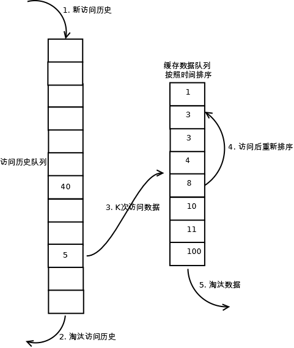

# lrucache

## 1. 原理
LRU（Least recently used，最近最少使用）算法根据数据的历史访问记录来进行淘汰数据，如果数据最近被访问过，那么将来被访问的几率也更高。

依据此原理，可以设计微服务的二级缓存结构，用于存储经常访问的热数据，实现避免频繁访问后端数据库的相同数据逻辑。当使用该缓存当做二级缓存时，需要保证缓存中数据和后端数据的一致性。

## 2. 实现
lrucache实现是使用一个链表保存缓存数据，详细算法实现如下：

1. 新数据插入到链表尾部；

2. 每当缓存命中（即缓存数据被访问），则将数据移到链表尾部；

3. 当链表满的时候，将链表头部的数据丢弃。

## 3. 分析
【命中率】
当存在热点数据时，LRU的效率很好，但偶发性的、周期性的批量操作会导致LRU命中率急剧下降，缓存污染情况比较严重。

【复杂度】

O(1)-O(n）

【代价】

命中时需要遍历链表，找到命中的数据块索引，然后需要将数据移到头部。

## 4. 未来
为了解决偶发性的、周期性的批量操作lrucache而导致的命中率急剧下降，可以考虑使用LRU-K缓存算法。

核心：将热数据标准”最近使用过的“判断标准扩展为“最近使用过K次”，只有最近使用过K次才认为是热数据，为了保存热数据，需要再引入一个队列存储。

实现： 只有当数据的访问次数达到K次的时候，才将数据放入缓存。当需要淘汰数据时，LRU-K会淘汰第K次访问时间距当前时间最大的数据，详细算法实现如下：

1. 数据第一次被访问，加入到左侧的访问历史列表；

2. 如果数据在访问历史列表里后没有达到K次访问，则按照原来的lrucache方式淘汰；

3. 当访问历史队列中的数据访问次数达到K次后，将左侧数据迁移到右侧缓存队列中，右侧缓存队列重新按照时间排序；

4. 右侧缓存数据队列中被再次访问后，重新排序；

5. 需要淘汰数据时，淘汰缓存队列中排在末尾的数据，即：淘汰“倒数第K次访问离现在最久”的数据。